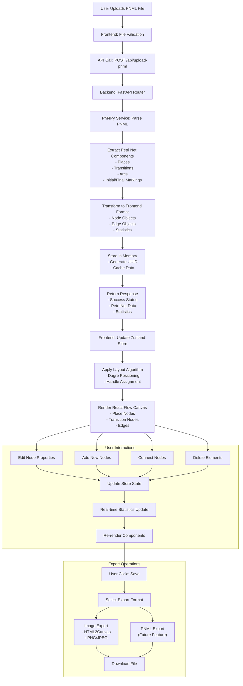

# Petri Net Visualizer - Data Flow Diagram

## Overview

This document describes the data flow within the Petri Net Visualizer application, from initial PNML file upload through visualization, editing, and export operations.

## Data Flow Diagram



## Detailed Data Flow Processes

### 1. PNML Import Process

#### Step 1: File Upload

- **Input**: User selects PNML file (.pnml extension)
- **Validation**: Frontend checks file type and size
- **Data Format**: Binary file content

#### Step 2: API Communication

- **Endpoint**: `POST /api/upload-pnml`
- **Content-Type**: `multipart/form-data`
- **Payload**: File binary data + metadata

#### Step 3: Backend Processing

- **Parser**: PM4Py library processes PNML XML
- **Extraction**:
  - Places with tokens and markings
  - Transitions (visible/invisible)
  - Arcs with weights
  - Network metadata

#### Step 4: Data Transformation

```javascript
// Example transformed data structure
{
  nodes: [
    {
      id: "place1",
      type: "place",
      position: { x: 100, y: 100 },
      data: {
        id: "place1",
        name: "Start Place",
        tokens: 1,
        isInitialMarking: true,
        isFinalMarking: false,
        attachPoints: 4
      }
    }
  ],
  edges: [
    {
      id: "arc1",
      source: "place1",
      target: "trans1",
      type: "default",
      data: { weight: 1 }
    }
  ],
  statistics: {
    places: 5,
    transitions: 4,
    arcs: 8,
    tokens: 3
  }
}
```

### 2. Visualization Process

#### Step 1: State Management

- **Store Update**: Zustand store receives parsed data
- **State Synchronization**: All components react to state changes

#### Step 2: Layout Application

- **Algorithm**: Dagre hierarchical layout
- **Positioning**: Automatic node placement
- **Handle Assignment**: Smart connection point allocation

#### Step 3: Rendering

- **React Flow**: Renders interactive canvas
- **Custom Components**: PlaceNode and TransitionNode
- **Real-time Updates**: Immediate visual feedback

### 3. User Interaction Flow

#### Node Property Editing

```javascript
// Data flow for property updates
User Input → ElementPanel → Store Update → Node Re-render → Statistics Update
```

#### Node Creation

```javascript
// Data flow for adding nodes
Button Click → Generate ID → Create Node Object → Add to Store → Apply Layout → Render
```

#### Connection Creation

```javascript
// Data flow for connecting nodes
Drag Handle → Validate Connection → Create Edge → Update Store → Re-render
```

### 4. Export Process

#### Image Export

- **Trigger**: User selects PNG/JPEG from Save menu
- **Capture**: HTML2Canvas captures React Flow viewport
- **Processing**: Convert to image format with quality settings
- **Download**: Browser downloads generated image file

#### PNML Export (Future)

- **Data Collection**: Gather current state from store
- **Transformation**: Convert to PNML XML format
- **Validation**: Ensure PNML compliance
- **Download**: Generate and download .pnml file

## Data Structures

### 1. Node Data Structure

```javascript
{
  id: string,           // Unique identifier
  type: "place" | "transition",
  position: { x: number, y: number },
  data: {
    id: string,         // Display ID
    name: string,       // Display name
    label: string,      // React Flow label
    tokens?: number,    // For places only
    isInitialMarking?: boolean,
    isFinalMarking?: boolean,
    isInvisible?: boolean, // For transitions only
    attachPoints: number
  }
}
```

### 2. Edge Data Structure

```javascript
{
  id: string,           // Format: "source-target"
  source: string,       // Source node ID
  target: string,       // Target node ID
  type: "default",
  data: {
    weight: number,     // Arc weight
    originalId?: string // Original PNML ID
  },
  markerEnd: {
    type: "arrowclosed"
  }
}
```

### 3. Statistics Structure

```javascript
{
  places: number,
  transitions: number,
  arcs: number,
  tokens: number,
  visible_transitions: number,
  invisible_transitions: number,
  has_initial_marking: boolean,
  has_final_marking: boolean,
  is_sound: boolean
}
```

## Error Handling Flow

### 1. Upload Errors

```
Invalid File → Frontend Validation → Error Message → User Retry
Network Error → API Failure → Error State → User Notification
Parse Error → Backend Exception → Error Response → User Feedback
```

### 2. Interaction Errors

```
Invalid Connection → Validation Check → Prevent Action → Visual Feedback
Duplicate ID → Store Validation → Error Message → Input Reset
```

## Performance Considerations

### 1. Data Optimization

- **Lazy Loading**: Heavy dependencies loaded on demand
- **Memoization**: React components optimized for re-rendering
- **State Batching**: Multiple updates batched together

### 2. Network Optimization

- **Single Upload**: One API call for complete PNML processing
- **Caching**: Backend stores processed data for retrieval
- **Compression**: Efficient data serialization

### 3. Rendering Optimization

- **Virtual Rendering**: React Flow handles large graphs efficiently
- **Selective Updates**: Only changed components re-render
- **Debounced Actions**: User inputs debounced for performance
