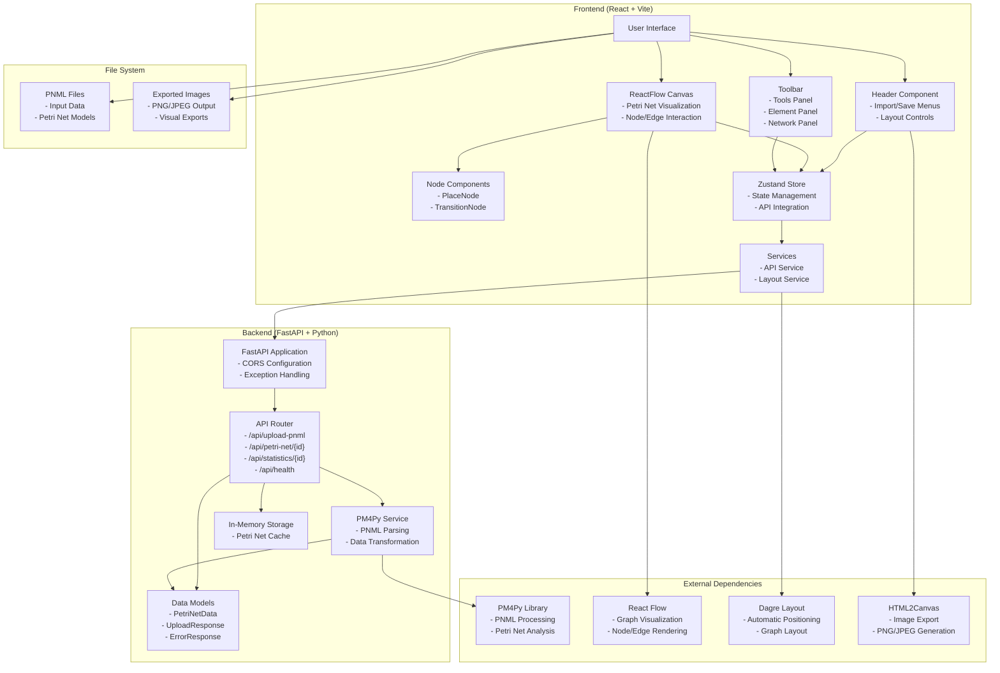

# Petri Net Visualizer - System Architecture

## Overview

The Petri Net Visualizer is a modern web application built with a client-server architecture that enables users to import, visualize, edit, and export Petri net models. The system leverages industry-standard libraries and frameworks to provide a robust and user-friendly experience.

## Architecture Diagram



## Component Details

### Frontend Architecture

#### 1. User Interface Layer

- **React 19.1.0**: Modern React with latest features
- **Vite**: Fast build tool and development server
- **CSS Modules**: Scoped styling for components

#### 2. State Management

- **Zustand 5.0.5**: Lightweight state management
- **Centralized Store**: Single source of truth for application state
- **Real-time Updates**: Automatic statistics calculation and UI updates

#### 3. Visualization Engine

- **React Flow 12.6.4**: Professional graph visualization library
- **Custom Node Types**: PlaceNode and TransitionNode components
- **Interactive Canvas**: Drag, drop, connect, and edit functionality

#### 4. Layout System

- **Dagre 0.8.5**: Hierarchical graph layout algorithm
- **Multiple Directions**: Horizontal and vertical layout options
- **Auto-positioning**: Intelligent node placement and edge routing

### Backend Architecture

#### 1. API Layer

- **FastAPI 0.104.1**: Modern, fast Python web framework
- **RESTful Design**: Standard HTTP methods and status codes
- **CORS Support**: Cross-origin resource sharing for development

#### 2. Business Logic

- **PM4Py Service**: Core PNML processing and analysis
- **Data Transformation**: Convert PM4Py objects to frontend-compatible format
- **Error Handling**: Comprehensive error management and logging

#### 3. Data Layer

- **In-Memory Storage**: Fast access for demo purposes
- **Pydantic Models**: Type-safe data validation and serialization
- **UUID-based IDs**: Unique identification for stored models

## Technology Stack

### Frontend Dependencies

```json
{
  "react": "^19.1.0",
  "react-dom": "^19.1.0",
  "@xyflow/react": "^12.6.4",
  "zustand": "^5.0.5",
  "dagre": "^0.8.5",
  "html2canvas": "^1.4.1"
}
```

### Backend Dependencies

```txt
fastapi==0.104.1
uvicorn[standard]==0.24.0
pm4py==2.7.11.7
python-multipart==0.0.6
pydantic==2.5.0
```

## Design Principles

### 1. Separation of Concerns

- Clear separation between frontend and backend responsibilities
- Modular component architecture
- Service-oriented design patterns

### 2. Scalability

- Stateless backend design
- Component-based frontend architecture
- Efficient state management

### 3. User Experience

- Real-time visual feedback
- Intuitive drag-and-drop interface
- Responsive design for different screen sizes

### 4. Maintainability

- TypeScript-like validation with Pydantic
- CSS Modules for scoped styling
- Comprehensive error handling

## Security Considerations

### 1. Input Validation

- File type validation for PNML uploads
- Size limits on uploaded files
- Sanitization of user inputs

### 2. CORS Configuration

- Restricted origins for development
- Configurable for production deployment

### 3. Error Handling

- No sensitive information in error messages
- Graceful degradation on failures
- Comprehensive logging for debugging

## Performance Optimizations

### 1. Frontend

- React 19 with automatic optimizations
- Efficient re-rendering with Zustand
- Lazy loading of heavy dependencies (html2canvas)

### 2. Backend

- FastAPI's async capabilities
- In-memory caching for frequently accessed data
- Efficient PNML parsing with PM4Py

### 3. Network

- Minimal API calls
- Efficient data serialization
- CORS optimization for development
